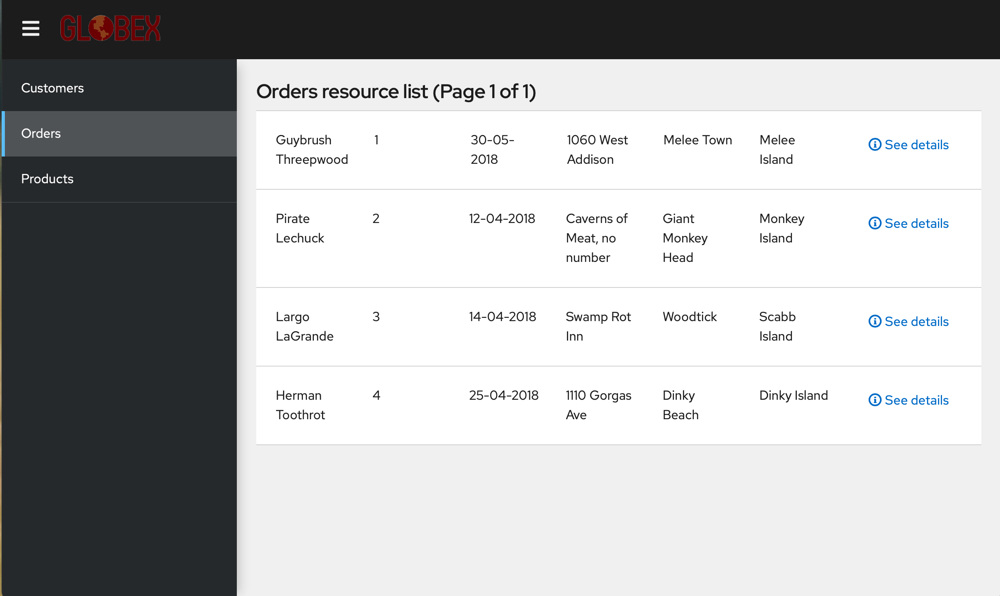

= OpenShift Application Modernization Demo

// Source for graphics: https://docs.google.com/presentation/d/1CzUvIk4_v2wz3kMo7S3_bhWcNTGAVpa0x6rAZ2XwGK8/edit?usp=sharing

== Overview

====
TBD
====

== Provisioning the demo environment

. Log into RHPDS (https://rhpds.redhat.com)
. Request the catalog item *OpenShift 4 App Modernization Demo* from the catalog *OpenShift Demos*.
.. For now make sure you switch to the second page and select *DEV* as the environment.
+
The deployment will take about 90 minutes.
. Take note of the information in the e-mail you receive. It will look similar to the example below (note that all passwords have been obfuscated from this example).
+
.Example e-mail:
[source,text]
----
Openshift Console: https://console-openshift-console.apps.cluster-2xj7m.sandbox37.opentlc.com
Openshift API for command line 'oc' client: https://api.cluster-2xj7m.sandbox37.opentlc.com:6443
Download oc client from http://d3s3zqyaz8cp2d.cloudfront.net/pub/openshift-v4/clients/ocp/stable-4.10/openshift-client-linux.tar.gz

HTPasswd Authentication is enabled on this cluster.
Users user1 .. user1 are created with password `xxxxxxxx`
User `admin` with password `xxxxxxxxx` is cluster admin.
You can access Gitea via the URL https://gitea.apps.cluster-2xj7m.sandbox37.opentlc.com
The Gitea admin username is 'opentlc-mgr'.
The Gitea admin password is 'xxxxxxxx'.
A Gitea user 'lab-user' was created, with the password 'xxxxxxxx'
The following repositories were migrated for the created users:
https://github.com/rromannissen/appmod-enablement

Migration Toolkit for Applications:
  URL:      https://secure-mta-web-console-openshift-mta.apps.cluster-2xj7m.sandbox37.opentlc.com
  User:     mta
  Password: xxxxxxxx

Konveyor Tackle (Migration Toolkit for Applications Upstream):
  URL:      https://tackle-tackle.apps.cluster-2xj7m.sandbox37.opentlc.com
  User:     tackle
  Password: xxxxxxxx

Red Hat Enterprise Virtualization Properties:
  URL:      https://rhvm.dev.cnv.infra.opentlc.com
  Hostname: rhvm.dev.cnv.infra.opentlc.com
  User:     migrateuser-2xj7m@internal
  Password: xxxxxxxx

Customer Service (Tomcat VM)
  VM Name:     tomcat-2xj7m
  IP Address:  169.60.225.222
  User:        migrateuser-2xj7m
  Password:    xxxxxxxx

Oracle Database VM (on RHEV):
  VM Name:     oracle-2xj7m
  IP Address:  169.60.225.221
  User ID:     lab-user
  VM Password: xxxxxxxx

  SSH Command: ssh lab-user@169.60.225.221

Oracle Database:
  Database: customer
  User: customer
  Password: xxxxxxxx
  Admin Password: xxxxxxxx

Visual Studio Code Server is available on the Bastion VM.
  URL:      https://bastion.2xj7m.sandbox37.opentlc.com:8443
  Password: xxxxxxxx

You can access your bastion via SSH:
ssh wkulhane-redhat.com@bastion.2xj7m.sandbox37.opentlc.com

Make sure you use the username 'wkulhane-redhat.com' and the password 'xxxxxxxxxx' when prompted.
----

== Explore the environment

Your initial demo environment has the whole micro services application deployed and working.

.Initial Deployment Architecture
image::images/architecture_initial.png[width=100%]

Your initial state for this demo is an environment that is spread over Red Hat Enterprise Virtualization and Red Hat OpenShift Container Platform.

Your application has been partially already moved from your legacy environments to OpenShift.

The application is a multi service application consisting of a Node.js frontend service which is getting its data via a gateway service. The gateway service is connected to three backend services: customers, orders and inventory. Each of the backend services uses its own database to store data.

The services running no OpenShift are deployed in a namespace `retail`. The services are also managed using a GitOps approach by *ArgoCD*.

All source code for the applications as well as the GitOps YAML manifests for all services are stored in a (GitHub compatible) Gitea repository that for demo purposes is hosted on the OpenShift cluster.

The problem right now is the customers service:

* The customers service uses an old Java code base running on Apache Tomcat in a VM on Red Hat Enterprise Virtualization. In the course of this demonstration you will modernize the Java Code and then deploy the application to OpenShift on top of Red Hat Web Server.
* The customers database is using an Oracle 21c database running as a VM in Red Hat Enterprise Virtualization. Because this is Oracle you can not deploy the database as a Pod on OpenShift - therefore you will migrate the VM to OpenShift Virtualization using the OpenShift Migration Toolkit for Virtualization.

When you have finished this demonstration your deployment architecture should look like this:

.Finished deployment architecture

== OpenShift Configuration

=== OpenShift Cluster

Your OpenShift cluster is already configured with everything you need. Here are the details:

* Latest stable OpenShift Container Platform 4.10 is deployed as a bare metal single node OpenShift environment.
* The following operators have been installed and configured:
** Gitea (to host the source code repositories)
** OpenShift Virtualization (to ultimately run the migrated Oracle VM)
** Migration Toolkit for Virtualization (to facilitate the migration of the Oracle VM from Red Hat Enterprise Virtualization to Red Hat OpenShift Container Platform)
** OpenShift GitOps: to manage the deployed services using a GitOps approach through ArgoCD
** OpenShift Pipelines: to build the customer application from source code and deploy to the `retail` project using GitOps
** Migration Toolkit for Applications (Tackle): to help modernize the customer service Java source code.

Instructions on how to access the OpenShift console, Gitea or Migration Toolkit for Applications along with userids and passwords can be found in the provisioning e-mail.

=== Bastion VM

Your Bastion VM for the cluster has all the necessary tools installed (`oc`, `virtctl`, `tkn`). It also has a copy of the `appmod-enablement` repository in your home directory.

Instructions on how to access the bastion VM can be found in the provisioning e-mail.

=== Visual Studio Code (Server)

To facilitate an easy demonstration environment the bastion has a Visual Studio Code Server installed. This means you don't need to install and configure VSCode on your demo laptop but you can just use the one provided in a web browser.

This makes it easy to change any source code (or configuration files) in the cloned repository.

The URL and password for the VSCode Server can be found in the provisioning e-mail.

.Example VSCode Server in web browser

[NOTE]
You see the configuration file for the *gateway* service in the screenshot above. You will notice that two services (orders and inventory) point to the services on OpenShift and that the customers service points to the customers VM on RHEV.

== Demonstrating the Application

You can show that the application is working in its current deployment.

. Find the `Route`` for the *Frontend* application
+
[source,sh]
----
oc get route ordersfrontend -n retail
----
+
.Sample Output
[source,texinfo]
----
NAME             HOST/PORT                                                          PATH   SERVICES         PORT   TERMINATION     WILDCARD
ordersfrontend   ordersfrontend-retail.apps.cluster-amawk.amawk.devel.opentlc.com          ordersfrontend   web    edge/Redirect   None
----

. Navigate to the orders frontend route. You can use either https or http (which will be redirected to http).
+

. Click through the three panels on the left.
.. Customer doesn't work (bug in the code)
.. Orders shows current orders. You can tell that customers is working beause the first two columns are populated by the customers service
.. Products shows the current inventory

==  Demonstrating the Oracle Database

=== Connect using DBeaver

You can use *DBeaver (Community Edition)* (https://dbeaver.io) to connect to the Oracle database on RHEV.

. Launch *DBeaver*
. Right click the *Database Navigator* Panel and select *Create* -> *Connection*
. Select *Oracle* and click *Next*
. Fill in the properties (use the values from your welcome e-mail), leave default values where not specified otherwise
.. *Host*: `169.60.225.218`
.. *Database*: `XEPDB1`
.. *Username*: `customer`
.. *Password*: `<from the e-mail>`
. Click *Test Connection ...*. You should see a success message.
. Click *Finish*

Next you can show the contents of the database:

. Expand *XEPDB1* then expand *Schemas*
. Expand *CUSTOMER* then expand *Tables*
. Double click on *CUSTOMERS* under *Tables*
. On the right you can show the table properties (first tab) and table properties (*Data* tab)

=== Demo the Customer Application deployed on Tomcat

The RHEV environment not only has the Oracle Database VM deployed but it also hosts another VM which runs the old customer application on top of Apache Tomcat.

From a terminal window you can use `curl` to demonstrate that the application is connected to the database.

. Use the IP Address of the *Customer Service (Tomcat VM)* to access the customer service.
+
[source,sh]
----
curl http://169.60.225.219:8080/customers/customers/1
----
+
.Sample Output
[source,texinfo]
----
{"id":1,"username":"phlegm_master_19","name":"Guybrush","surname":"Threepwood","address":"1060 West Addison","zipCode":"ME-001","city":"Melee Town","country":"Melee Island"}%
----

. Try another customer
+
[source,sh]
----
curl http://169.60.225.219:8080/customers/customers/2
----
+
.Sample Output
[source,texinfo]
----
{"id":2,"username":"hate_guybrush","name":"Pirate","surname":"Lechuck","address":"Caverns of Meat, no number","zipCode":"MO-666","city":"Giant Monkey Head","country":"Monkey Island"}
----

== Migrate the applications from RHEV to OpenShift

The steps you will follow to migrate the *customers* service from Red Hat Enterprise Virtualization to Red Hat OpenShift Container Platform are as follows:

* Migrate the *Oracle VM* from RHEV to OpenShift Virtualization using the OpenShift Migration Toolkit for Virtualization
* Modernize the Java source code for the *customers* application
* Use the Tekton Pipeline to build and deploy the new, modernized application using Red Hat Web Server instead of Apache Tomcat as the runtime.
* Set up the configuration for the *customer* service to connect to the Oracle database VM which is now running on OpenShift Container Platform
* Test the *customer* service
* Update the configuration for the *gateway* service to now point to the modernized *customer* service.
* Demonstrate that your *frontend* service still works as before.

=== Migrate the Oracle VM from RHEV to OpenShift

==== Prerequisites

. Download the CA Certificate for your RHEV environment. You need to do that on your laptop because you will need to drag the file into the MTV console later.
+
[source,sh]
----
# Set this variable to the RHEV hostname from the e-mail
export RHEV_HOST=<RHEV_HOSTNAME>

wget -O $HOME/pki-resource.cer --no-check-certificate "https://${RHEV_HOSTNAME}/ovirt-engine/services/pki-resource?resource=ca-certificate&format=X509-PEM-CA"
----

. Or if you prefer the web browser:
.. Navigate to `https://<RHEV_HOSTNAME>/ovirt-engine/services/pki-resource?resource=ca-certificate&format=X509-PEM-CA` in your web browser (replace *<RHEV_HOSTNAME>* with the hostname from your welcome e-mail - e.g. `rhvm.dev.cnv.infra.opentlc.com`).
.. On most systems this will download a file `pki-resource.cer` into your `Downloads` folder.
.. Take a note where this file got downloaded to. You will need it a little bit later.

=== Set up Virtualization Provider in MTV

. Log into the OpenShift Web Console using the URL and *admin* credentials provided
. On the left click on *Virtualization* -> *Virtual Machines*
. From the *Projects* drop down select the *retail* project.
.. There are no Virtual Machines yet.
. Click *Launch Migration Tool* to launch the OpenShift Migration Toolkit for Virtualization.
. Log in using your *admin* credentials
.. If this is the first time you are logging in click the blue *Get started* button.
. On the list of *Providers* click *Add provider*
. Select *Red Hat Virtualization* from the list of providers. Fill in the information from your e-mail:
.. *Name*: `rhev`
.. *RHV Manager host name or IP address*: The hostname from your e-mail. For example `rhvm.dev.cnv.infra.opentlc.com`
.. *RHV Manager user name*: the username from your e-mail. For example `migrateuser-wkama@internal`
.. *RHV Manager passsword*: the password from yoru e-mail. For example `niIEPihdCR7I`
.. *CA Certificate*: Drop the previously downloaded CA Certificate File
.. Click *Add*.
. MTV will validate your provider and after a few seconds the status should switch to *Ready*.

=== Create and execute Migration Plan

. In the *Migration Toolkit for Virtualization* console navigate to *Migration Plans*.
. Click *Create Plan*
. On the *General* page use the following parameters:
.. *Plan name*: `customers-database`
.. *Source provider*: select the *rhev* source provider you previously created
.. *Target provider*: select *host* (the OpenShift cluster you are currently on)
.. *Target namespace*: select *retail*
. Click *Next*
. On the *VM Selection / Filter* page select the checkbox next to *All datacenters*
. Click *Next*
. On the *VM Selection / Select VMs* page select the VM that got created for you. You will find the name in your welcome e-mail (future). The name will be something like *oracle-XXXXX* where XXXXX is your GUID.
. Click *Next*
. On the *Network Mapping* page click on *Select a network mapping* and select *Create a network mapping*.
. Leave the defaults and click *Next*
. On the *Storage Mapping* page click on *Select a storage mapping* and select *Create a storage mapping*.
. Change the *Target Storage Class* to `gp2-csi` and click *Next*
. On the *Type* page select *Cold migration* and click *Next*
// . On the *Type* page select *Warm migration* and click *Next*
. On the *Hooks* page click *Next*
. On the *Review* page click *Finish*

Now your Migration Plan is ready to use.

// WKTBD: figure out correct permissions for Warm Migration to work....
// The migration will happen in two stages. First a snapshot of the current state of the disk in RHEV is copied to OpenShift. The database VM can keep running in RHEV during that stage not disrupting our running application.

// Once the *incremental data copy* step has finished you can then execute the cutover from RHEV to OpenShift Virtualization.

To execute the plan click the *Start* button next to your *customers-database* migration plan and confirm by clicking the blue *Start* button in the popup window.

Because you are running a *cold migration* the VM in RHEV gets shutdown first.

The migration will take about 15-25 minutes after which you will have a running Oracle database VM in your OpenShift cluster.

Once the migration succeeds you will find a VM called `oracle-xxxxx` in your retail namespace.

=== Post Migration Tasks:

The VM is not yet reachable from other applications on the cluster. You will need to add a label to the VM and then create a service to be able to connect to the database on the VM.

. Add a label to your VM's template metadata (make sure to replace `wkama` with your GUID).
+
[source,sh]
----
oc patch vm oracle-wkama --type=merge --patch='{"spec": { "template": { "metadata": { "labels": { "app": "oracle-wkama"}}}}}' -n retail
----

. Restart the VM for the VM Pod to pick up the new label.
+
You can restart the VM either from the OpenShift Web Console or using `virtctl` from the bastion VM.

.. Navigate to your VM in the OpenShift Web Console:
... *Virtualization* -> *VirtualMachines*
... Click on your VM
... From the *Action* drop down select *Restart* then confirm by clicking *Restart* in the pop up dialog.
.. Or use `virtctl` to restart the VM:
+
[source,sh]
----
virtctl restart oracle-${GUID} -n retail
----

. Create service for database vm:
+
[source,sh]
----
oc create service clusterip oracle-${GUID} --tcp=1521:1521 --tcp=2022:22 -n retail
----

. Make sure your service has the endpoint for the Oracle VM pod as an Endpoint:
+
[source,sh]
----
oc describe svc oracle-${GUID} -n retail
----
+
.Sample Output
[source,texinfo]
----
Name:              oracle-wkama
Namespace:         retail
Labels:            app=oracle-wkama
Annotations:       <none>
Selector:          app=oracle-wkama
Type:              ClusterIP
IP Family Policy:  SingleStack
IP Families:       IPv4
IP:                172.30.4.130
IPs:               172.30.4.130
Port:              1521-1521  1521/TCP
TargetPort:        1521/TCP
Endpoints:         10.128.1.14:1521
Port:              2022-22  2022/TCP
TargetPort:        22/TCP
Endpoints:         10.128.1.14:22
Session Affinity:  None
Events:            <none>
----

== Modernize Customer Java Application

====
TBD: https://github.com/deewhyweb/app-modernization-workshop
====

== Use OpenShift Pipelines to build and deploy the modernized customer application.

=== Change Customer Application to connect to the migrated VM on the cluster

The existing customer pod connects to the VM running in RHEV. Unless you started the VM again in RHEV this application now has no database. But since we migrated the VM over to OpenShift we need to tell the application to connect to the VM on OpenShift instead.

You will need to change source code in order to point to the VM.

. In a web browser navigate to the Visual Studio Code window using the URL and password from your welcome e-mail.
. Navigate to the file `appmod-enablement / customer-tomcat-gitops / helm / secret / persistence.properties`
. Change the *jdbc.url* to use the service name for your VM on OpenShift. It should look somewhat like this:
+
[source,text]
----
jdbc.url=jdbc:oracle:thin:@oracle-wkama:1521/xepdb1
----

. Save the file.

// . Configure Git: in VSCode switch to the Terminal and run these two commands:
// +
// [source,sh]
// ----
// git config --global user.email "you@example.com"
// git config --global user.name "Your Name"
// ----

. Switch to the Source Control section in VSCode, commit and push the change.
(you may need to push from the Terminal. It will prompt for user (lab-user) and password (openshift))

=== Start an OpenShift Pipeline run

In the future we will have a trigger and event listener on the pipeline. But for now you have to kick off the pipeline run manually

. Log into OpenShift Web Console
. Navigate to *Pipelines* -> *Pipelines*
. Click the dots menu to the right of the pipeline `customers-deployment-pipeline` and select *Start last run*

== Appendix

=== Recover a locked Oracle database user (customer)

If the customer application can not connect to the Oracle database because the Oracle user is locked you can follow this procedure to unlock the customer user in Oracle.

. From your bastion VM connect to the Oracle VM
+
[source,sh]
----
virtctl console oracle-${GUID}
----

. Switch to the `oracle` user:
+
[source,sh]
----
sudo -i
su - oracle
----

. Determine the current IP Address of your Oracle VM pod
+
[source,sh]
----
ip address | grep inet | grep -v 127 | grep -v inet6
----

. Use the previously determined IP Address to connect to the Oracle Database. Replace `ORACLE_ADMIN_PASSWORD` with the Oracle admin password from your welcome e-mail.
+
[source,sh]
----
sqlplus sys/ORACLE_ADMIN_PASSWORD@//10.0.2.2:1521/XEPDB1 as sysdba
----

. Fix the locked user:
+
[source,sh]
----
SQL> conn customer as sysdba
SQL> select account_status, lock_date from dba_users where username = 'CUSTOMER';
SQL> alter user customer account unlock;
----

. Logout of everything by pressing `Ctrl-D` repeatedly until you are at the VM login screen.
. Press `Ctrl-]` to disconnect from the virtctl console.

Your customer pod should now be able to connect to your Oracle VM pod.

=== Possible future extension to the VSCode Server workload

Existing Role: https://github.com/ansible/workshops/blob/f1a5ac477558f9834391df90445970a6ad0f118e/roles/code_server/tasks/codeserver.yml#L68
